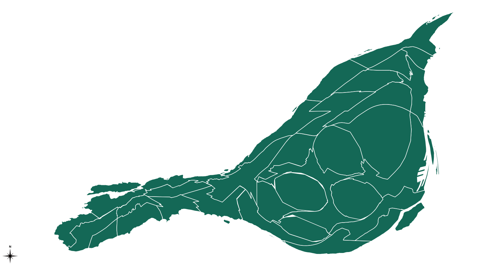

This project was an investigation into the ways that we perceive and understand the urban landscapes around us. 

### Overview

In his seminal book, The Image of the City, Kevin Lynch identified legibility as an important characteristic of pleasurable and engaging cities[^1]. Legibility is the perceptual quality of urban landscapes that makes them remarkable and distinctive. A city made up of highly legible environments will be clearly imagined in the minds of those that live within it. In this project, I developed a gamified, web-based survey tool that I used to collect data and measure the legibility of Montreal's many urban landscapes. 

[^1]: Lynch, K. (1960). The image of the city (Vol. 11).

### The survey tool

I was inspired by the well-loved game, [Geoguessr](https://www.geoguessr.com/), which places users in an unknown Google Street View location and asks them to guess where in the world they are based on what they see around them. Using the Google Street View API, some JavaScript, HTML, and CSS, I built a simple version of this game for Montreal: [Geo-MTL](https://hannahker.github.io/geo-mtl/). 

I used Geo-MTL to determine the extent to which different parts of Montreal are more or less recognizable to its residents. I thus considered recognizability to be a proxy for legibility. More recognizable parts of the city, as measured by the distance between where a Google Street View panorama really was and where a user thought it was, were thought to be more legible. 

Since I built this survey tool from scratch, I had to think carefully about its design to ensure that it would be easy for participants to use. After building a prototype of the platform, I conducted a focus group to solicit feedback from users. 

### Results 

Over the span of 3 months, I collected data from 209 survey participants on the recognizability of urban landscapes throughout Montreal. The following cartogram shows the average recognizability of each borough in Montreal (larger = more recognizable).

I hypothesize that this warped map reflects, to some extent, the way that Montreal residents perceive their city. The center of Montreal, which is scaled up in this image, may, for example, feature more prominently in residents' cognitive image of the city. 