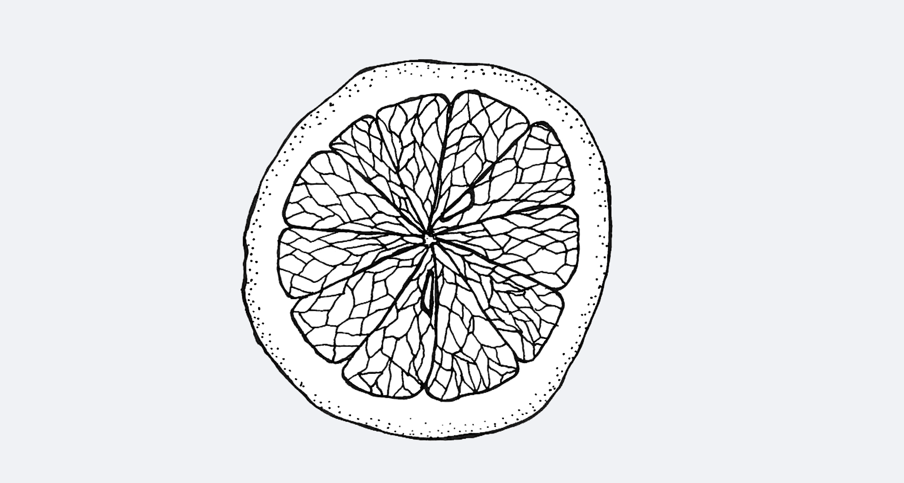

*Landscape allows and even encourages us to dream.* [^1] 

This quote from the renowned geographer, Yi-Fu Tuan, provides a useful starting point from which to examine the significance of the Orange Julep. While the Orange Julep is a unique building in the midst of a bland urban highway landscape, its existence is so much more than what meets the eye. The fantasy and imagination surrounding the Julep is what gives this Montreal landmark its true significance. This bulbous orange structure exists most strongly not in its physical presence, but rather in the minds of those that visit it. The Orange Julep is thus an excellent example of the connection that Yi-Fu Tuan highlights between reality and imagination in landscape. [^1]

A spectacular feature on an otherwise bland landscape, Montreal’s famous Orange Julep is much more than a fast-food restaurant. While the surrounding grey suburban nothingness reminds us of the pitfalls of uncontrolled urban sprawl, the Julep serves as a pleasant token of nostalgia for the city in the 50’s. This Montreal institution is a glimpse into the city’s past. While this great orange bulb sits hidden away on the periphery of the city, it reminds one of a time when waitresses rode rollerblades, fast food was exciting, and Montrealers were optimistic about the potential of automobiles and the great Decarie Expressway. Today, the surrounding parking lot is still a summertime weekly meeting place for classic car and bike enthusiasts. As such, the Orange Julep continues to be a source of pride for many Montreal residents.

---

These paragraphs are part of a larger investigation into the Orange Julep, and how it is an important cultural landscape within the city of Montreal. 

I created a small booklet, viewable [here](https://hannahker.com/OJ.pdf), through which I attempt to represent my experience of visiting and researching the Julep. 

[^1]: Tuan, Y. F. (1979). Thought and landscape: the eye and the mind’s eye. The interpretation of ordinary landscapes, 89-102.