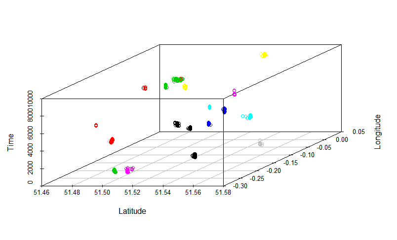

Twitter is an incredibly rich source of data that can help us understand the ways that people inhabit their cities. 

### Overview

In this project, I was interested in exploring the spatio-temporal characteristics of tweets in London over a week-long time period. I analyzed the spatial and temporal clustering patterns of approximately 40,000 tweets and found that many clusters could be linked to specific events taking place in the city. For example, I was able to detect events such as a West Ham vs Watford football game and an Adam Lambert concert. 

### The data 

I downloaded [this](http://followthehashtag.com/datasets/170000-uk-geolocated-tweets-free-twitter-dataset/) dataset of 170,000 geotagged tweets from the UK. All tweets were initially collected between April 14-21, 2016. Data filtering and preprocessing reduced the size of this dataset down to approx 40,000 tweets. 

### Methods and results 

I used R to create basic data visualizations to explore the spatial and temporal distribution of all the tweets in my dataset. For example, a histogram of the temporal distribution of tweets reveals a diurnal pattern, indicating that tweet frequency peaks at midday and falls during the evening. While some days reach a higher peak of tweet frequency than others, all days share a similar internal distribution. 

I detected spatio-temporal clusters using space-time scan statistics, implemented with the freely available [SaTScan](https://www.satscan.org/) software. I selected the top 100 most statistically significant clusters and analyzed the text content of the tweets in each cluster to determine whether or not a given cluster corresponded to a real-world event. Overall, I found 18 clusters that corresponded to real events. The following figure shows how each of these event clusters occupies a distinct spatio-temporal region. 

### Theoretical background 

This project was an investigation into how temporal attributes can contribute to spatial analyses in GIScience. While the methodology presented in this project is specifically applied to the case of geotagged Twitter data, it nevertheless can be interpreted as a general framework to inform subsequent spatiotemporal analyses that seek to capture events or other transient phenomena. The approach presented in this paper aligns with the aims of temporal GIS in that it challenges the primacy of static spatial representations and presents a means to more rigorously investigate time within a GIScience investigation. 

